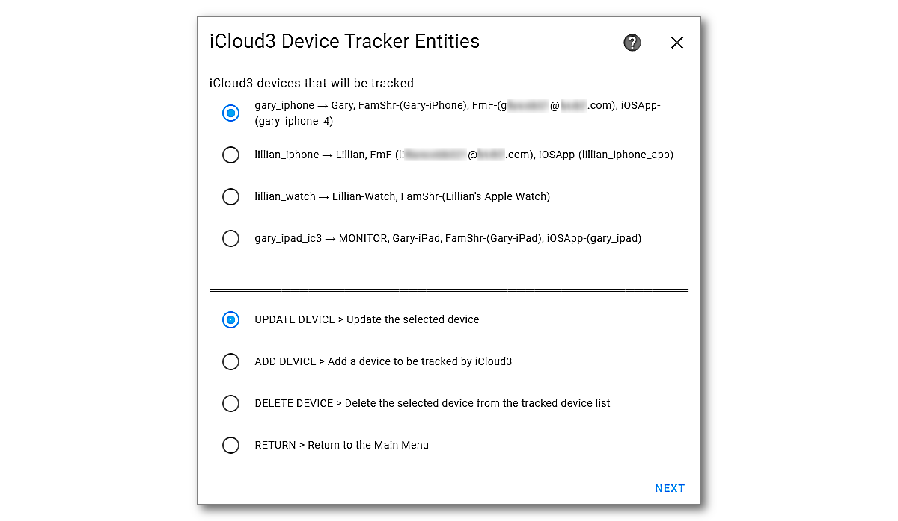

Every tracked device is assigned a *devicename*, just like all other Home Assistant devices. That name becomes part of the device_tracker and sensor entities created and maintained by iCloud3. The following example shows the entities created for the *gary_iphone* device:

- device_tracker.gary_iphone
- sensor.gary_iphone_travel_time, sensor.gary_iphone_zone_distance, etc.

Devices are added, deleted and updated on parameter screens in the *iCloud3 Configurator*:

- **List all iCloud3 Devices** -  Select *iCloud3 Devices* to list the devices. The devices are shown, along with it's *friendly name* and the  name of the physical device that supplies location information for the 3 tracking methods.
-  **Add a Device** - Select *Add Device* in the Command Area of the *iCloud3 Device Tracker Entities* screen. The *Add iCloud3 Device* screen is displayed. Assign a *devicename*, enter it's friendly name, select the physical device that supplies location information for the 3 tracking methods and other identification and configuration parameters.
- **Delete a Device** - Select *Delete Device* in the Command Area of the *iCloud3 Device Tracker Entities* screen. Then confirm the deletion.

!> The device_tracker and sensor entities for iCloud3 devices are created or deleted when you add or delete an iCloud3 device here. They are also changed if you change the iCloud3 devicename. Changing an iCloud3 device name or deleting it on the HA Devices and Entity screens will update the iCloud3 configuration files. The old names will be recreaed when HA restarts.

------

### iCloud3 Devices Tracker Entities screen

This screen lists the devices that have been added to iCloud3. 

------

### Update Tracked iCloud3 Device screen

This screen is used to add a new device or change the parameters of an existing device.

Special Notes:

- iCloud3 Device Name - The device_tracker entity name used through Home Assistant to access the device information. 
  - Device Tracker Entity - Example: *device_tracker.gary_iphone*
  - Sensor Entities - Example: *sensor.gary_iphone_travel_time, sensor.gary_iphone_zone_distance*

- Family Sharing List device, Find-my-Friends (FindMy) device and iOS App device - Select the physical device that will suppply location information. Select *None* if this tracking method is not used.
- Tracking Mode:
  - Tracked - Request location information when necessary.
  - Monitored - Use location information returned from iCloud Location Servers when another device asked for it.
  - Inactive - Do not track or monitor this device. This lets you not track a device without deleting from iCloud3.
- Track From Zones - Select another, non-Home zone(s) to be tracked from. See below.

------

### Tracking from More than One Zone

Normally, you track a device from the Home Zone. The sensor entities for travel time, distance, intervals, next update time, etc. are calculated for the Home Zone. iCloud3 also lets you track a device from another zone. It will calculate the same type of sensor entities for that zone. 

To track from another zone, select that zone in the *Track from Zones* parameter. Sensors are created for that zone that can be used to trigger automations, just like they are for the Home zone. There are a few differences:

- Sensor Entities - The zone name is added to the end of the entity name.
  - Home Zone -*sensor.gary_iphone_travel_time_home, sensor.gary_iphone_zone_distance_home*, etc.
  - Warehouse Zone - *sensor.gary_iphone_travel_time_warehouse, sensor.gary_iphone_zone_distance_warehouse*, etc.

- Sensor's Friendly Name - The zone's display-as friendly is added to the end of the sensor friendly name:
  - Home Zone - Gary TravelTime (Home), Gary ZoneDistance (Home), etc.
  - Warehouse Zone - Gary TravelTime (Warehouse), Gary ZoneDistance (Warehouse), etc.

The Track-from-Zone sensors mentioned above are optional, only the sensors that will be disolayed on a Lovelace card or used in an automation need to be created.  They are selected on *iCloud3 Configurator > Sensors* screen.

The sensors previously created without the zone name (above) have changed:

- Closer to the Home Zone - Show the Home Zone information
- Within 8km of the Other Zone and going towards it - Show the Other Zone's information
- Within 8km of the Other Zone and going away from it - Show the Home Zone's information
- Going towards both zones - Show the Home Zone's information if more than 8km away from the Other Zone
- Other Zone's information is displayed - It's first initial is displayed in the *distance* sensor (🅦 is shown for the Warehouse Zone).

​	
