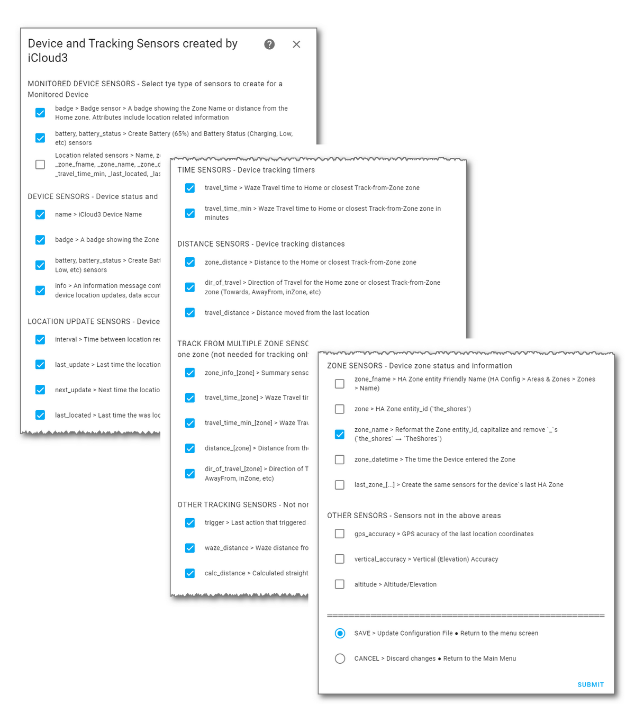

# Configuring iCloud3 with *The Configurator*

The iCloud3 parameters are separated into different categories, based on their type. The Configurator uses 2-menu screens to select the appropriate configuration screen.

The menu screens, as are the parameter configuration screens, are divided into 2-parts:

#### Selection Area - Above the horizontal line

This section shows the parameter update screens.

- **iCloud Account & Location Data Source** - Enter your iCloud account username/password and indicate where the location data comes from.
- **iCloud3 Devices** - Set up and configure the devices you want to track or monitor.
- **Sensors** - Over 25 sensors can be updated with device information, more if you are tracking from multiple zones. This screen lets you select the sensors you want to use.
- **Display Text As** - The Event Log can show information related to a device that you may want to hide (email addresses, phone numbers, etc.). This screen lets you specify a *display_as* text that will replace the real text (*gary@email.com* instead of the real email address, *garyinfl987@aol.com*).
- **Action Commands** - Commands that let you control iCloud3 operations (Restart, Pause Tracking, Resume or Restart Tracking, Enter Apple Verification Code, Reset iCloud Interface, etc.). These commands are also found on the Event Log custom card.
- **Event Log Configuration** - Specifies how information should be displayed on the Event Log (zone names, times, unit of measure)
- **Waze Route Distance & Time, Waze History Database** - Waze can be used to provide travel time and distance information to a tracked zone. The results can also be saved in a database. This screen is used to configure how Waze should operate.
- **inZone Intervals** - Different types of devices can have different polling intervals (time between location requests) when they are in a zone. You may want a Watch to have a short interval since it can not use the iOS App for zone enter/exit triggers and an iPhone to have a long interval since it can use the iS App. The default interval times for the different devices are set up on this screen. 
- **Special Zones** - There are two types of special zones that are set up on this screen.
  - *Pass Through Zone* - A Zone Enter delay in case you are just passing through a zone and the iOS App issues a Zone Enter Trigger.
  - *Stationary Zone* - A special zone created by iCloud3 when you are at the same location for an extended period of time (friend's house, doctors ofice, work, store, etc).

- **Other parameters** - General parameters that do not fall into the other categories that you will probably never change.

#### Command Area - Below the horizontal line

This section shows commands that specify what you want to do when you tap Next.

- **Select** - Display the parameter update screen selected above the line
- **Next Menu Page** - Displays the other menu.
- **Exit and Restart iCloud3** - Exit the Configurator. If you change device related information, iCloud3 needs to restart to use the new configuration (restart now or restart later). Other changes may not need a restart and you will just exit.

> ! Select the command (Submit, Next, Finish, etc) in the lower right corner of the screen to change screens.

> ! All update screens follow the same layout - The parameter fields you can change are above the line and the operational commands are below the line. 

------

### Examples of several parameter sceens

The following show several parameter update screens. they,and the other parameter screens, a discussed in detail in the *Configuring iCloud3* chapter.

Tracked devices are added and updated on this screen.

Many sensors can be created and updated by iCloud3. Those that should be created are selected on this screen.
