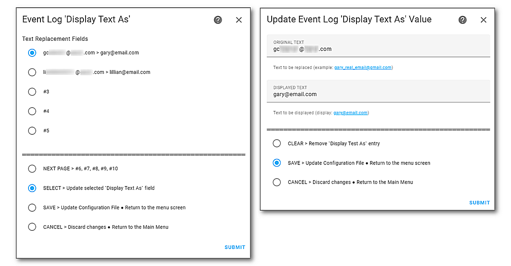
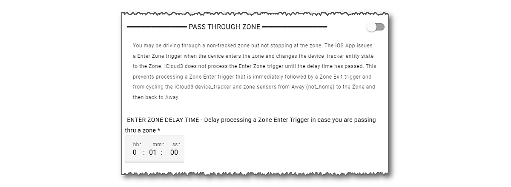

# Configuration Parameters -  GitHub commit

Configuration parameters for HA components are set up on the *HA Settings > Devices & Settings > Integrations > iCloud3 Configuration* screen previously discussed. 

1. Select **☰  HA Settings > Devices & Services > Integrations**
2. Select **iCloud3 > Configure**

3. Select **Configure** to open the menu screen on the left below.

The parameters are grouped into categories and updated on various screens introduced in the *Configuring iCloud3 with The Configurator* chapter earlier. 

- **iCloud Account & Location Data Source** - Enter your iCloud account username/password and indicate where the location data comes from.
- **iCloud3 Devices** - Set up and configure the devices you want to track or monitor.
- **Sensors** - Over 25 sensors can be updated with device information, more if you are tracking from multiple zones. This screen lets you select the sensors you want to use.
- **Display Text As** - The Event Log can show information related to a device that you may want to hide (email addresses, phone numbers, etc.). This screen lets you specify a *display_as* text that will replace the real text (*gary@email.com* instead of the real email address, *garyinfl987@aol.com*).
- **Action Commands** - Commands that let you control iCloud3 operations (Restart, Pause Tracking, Resume or Restart Tracking, Enter Apple Verification Code, Reset iCloud Interface, etc.). These commands are also found on the Event Log custom card.
- **Event Log Configuration** - Specifies how information should be displayed on the Event Log (zone names, times, unit of measure)
- **Waze Route Distance & Time, Waze History Database** - Waze can be used to provide travel time and distance information to a tracked zone. The results can also be saved in a database. This screen is used to configure how Waze should operate.
- **inZone Intervals** - Different types of devices can have different polling intervals (time between location requests) when they are in a zone. You may want a Watch to have a short interval since it can not use the iOS App for zone enter/exit triggers and an iPhone to have a long interval since it can use the iS App. The default interval times for the different devices are set up on this screen. 
- **Special Zones** - There are two types of special zones that are set up on this screen.
  - *Pass Through Zone* - A Zone Enter delay in case you are just passing through a zone and the iOS App issues a Zone Enter Trigger.
  - *Stationary Zone* - A special zone created by iCloud3 when you are at the same location for an extended period of time (friend's house, doctors ofice, work, store, etc).

- **Other parameters** - General parameters that do not fall into the other categories that you will probably never change.

------

### iCloud Account Login Credentials

This screen is used to enter the iCloud account username & password parameters. It was described in was discussed in the *Installing and Configuring iCloud3 - Step #5* chapter.

Notes:

- **Location Data Sourc**e - Normally, both the iCloud account and the iOS App provides location data. If, however, you are not using the iOS App on any device, and have no plans to do so, set the *Location Data Source* to *iCloud data only*.

- **Password** - This is stored in the configuration file in an encrypted format. 

- **Username & Password** - These fields are obscured on this screen. Select *Show/Hide username/password* to and select *Submit* to display them.

  

------

### Update iCloud3 Devices

This screen is used to:

- Add a new device (iPhone, iPad, etc) to be tracked
- Select a device to be updated
- Delete a device from the iCloud3 configuration, it's device_tracker entity and all sensor entities associated with the device.

> To stop a device from being tracked without deleting it, set it to an *Inactive* status on the *Update* screen. It's parameters are kept and it's device_tracker and sensor entities are not created.

------

### Update Tracked iCloud3 Device

This screen is used to:

- Update the device's parameters.
- Select the iCloud account Family Sharing and Find-my-Friends (FindMy app) device providing location information.
- Select the iOS App device_tracker entity that will be monitored. 
- Select the picture image that is displayed on the *device_tracker* entity and *sensor.[devicename]_badge entity*._
- Select the zones to be tracked from.

Notes:

- **Picture** - Image files (png, jpg and jpeg) in the *config/www/* and *config/www/icloud3/* (or *config/www/[your_event_log_card_directory]/*) directories are listed.
- **Tracking Mode** - specifies how the device should be handled.
  - Track - Full tracking, iCloud3 requests it's location.
  - Monitor - Report the devices location or battery status using data provided when a tracked device is updated
  - Inactive - Not tracked or monitored.

------

### Sensors

This screen is used to:

- Select the sensors that will be created for a device.
- Select the additional sensors that will be created for devices that are being tracked from other zones.
- Select the sensors that are created for a monitored device.

------

### Display Text-as

There may be text fields (account numbers, email addresses, etc) that should be considered private and not displayed on the Event Log or in the report that can be exported. 

This screen is used to:

- Specify the displayed text for text that should be hidden.

  

Notes:

- Ten display_as text fields are available.

------

### Action Commands

Action commands can be selected on the *Event Log > Actions* drop down list that control iCloud3's operations. Some of those commands can be also selected on this screen. This includes:

- Restart iCloud3
- Pause and Resume tracking 
- Reset and Reauthenticate the iCloud interface to generate a new 6-digit authentication code
- Export the Event Log
- Waze History Database Maintenance

------

### Event Log Configuration

The *Event Log* shows the activity associated with tracking a device. This is used to:

- Configure various display fields (time, distance).
- Specify how zone names should be displayed.
- Specify the directory containing the *icloud3-event-log-card.js* file. 

Notes:

- **iCloud Event Log Card Lovelace Resources Directory**- The Event Log Card File (*icloud3-event-log-card.js*) file is stored in this directory. The *www/icloud3* directory is created and the the *.js* file is copied into it when iCloud3 is installed. If you want to install the Event Log Card in another directory, change the name here and update the Lovelace Resources setup screen with that directory.

------

### Waze Route Distance & Time, Waze History Database

Waze is used to provide the driving distance and travel time between the current location and the Home and other tracked from zones. The next location update time is determined with this information. 

The distance and time returned from Waze is stored in the *Waze History Database* using the gps position with 4-decimal places of accuracy (11m/33ft). Over time, the database will contain the distance and time for many '11m blocks' along the routes normally driven.  Accessing the local database is much more efficient than an internet request to Waze, resulting in faster updates and fewer delays when the Waze Route servers are busy.

This screen is used to:

- Specify the Waze server to use in your location and how the distance and time should be determined.
- Specify if the Waze History Database should be used and parameters defining it's operation.

sharp

unsharp

Notes:

- **Waze Location Map Display** - This is described in the *Other Features* chapter.

------

### inZone Intervals

The *inZone Interval* is the time between location requests when a device is in a zone. When a device is added, an *inZone Interval* is assigned based on it's type (iPhone, iPad, Watch, etc.). 

- A longer interval (i.e., 2-hours) helps preserve battery life.
- A shorter interval (15-minutes) causes the battery to drain faster as it responds to a 'where are you' location request from iCloud Location servers.

This screen is used to set up the default values assigned to a device when it is added.

Notes:

- Devices that do not have the iOS App installed will not receive an Exit Zone trigger. A shorter interval (15-minutes) helps identify that the device has left the zone.

------

### Special Zones

#### Pass Through Zone

There are times when you may be driving through a zone on your way to another location. However, the iOS App does not know this and issues a *Zone Enter* trigger when you enter the zone you are actually driving through. 

The *Pass Through Zone* delay time prevents the *Enter Zone trigger* from being processed immediately. The Zone Enter trigger will be process if you are still in the zone when the delay timer expires. This only applies to non-tracked from zones, tracked-from zones (Home) are processed immediately.

#### Stationary Zone

A Stationary Zone is a zone that is created when the device has been in the same location for a period of time (at a mall, doctor's office, restaurant, friend's house, etc). The purpose of this zone is to reduce location requests when the device has not moved. 

------

### Other Parameters

This screen is used to configure other parameters that do not belong on the previous screens.

Notes:

- **Log Level** - Several levels of logging are available to help provide information when trying to identify a problem. Records are added to the HA Log file (*home-assistant.log*). This is explained further in the *Other Features* chapter.
  - **Debug** - Basic information.
  - **RawData** - Entries related to setting up zones and devices and the response received from iCloud when requesting a location.

