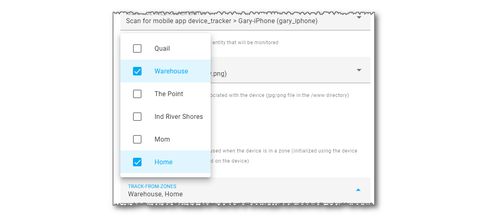
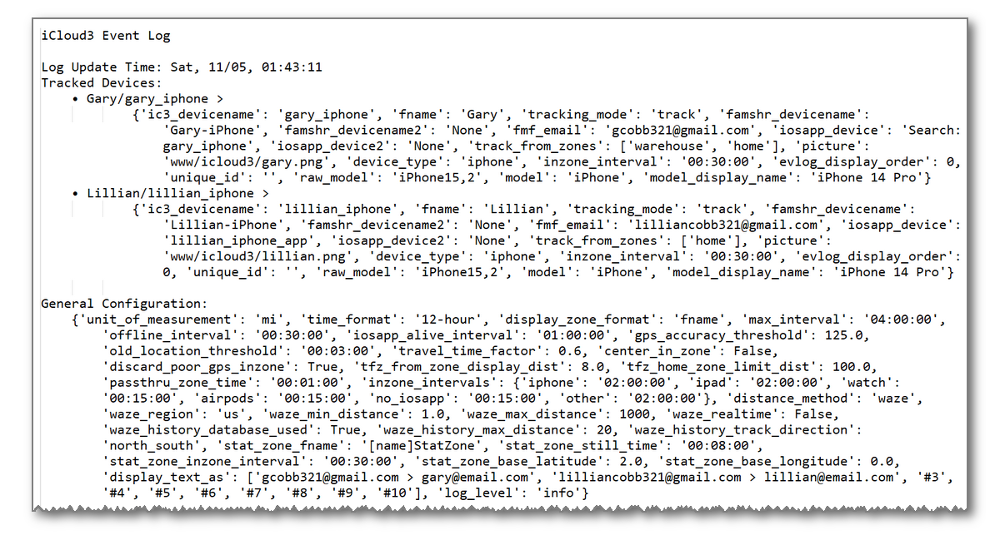
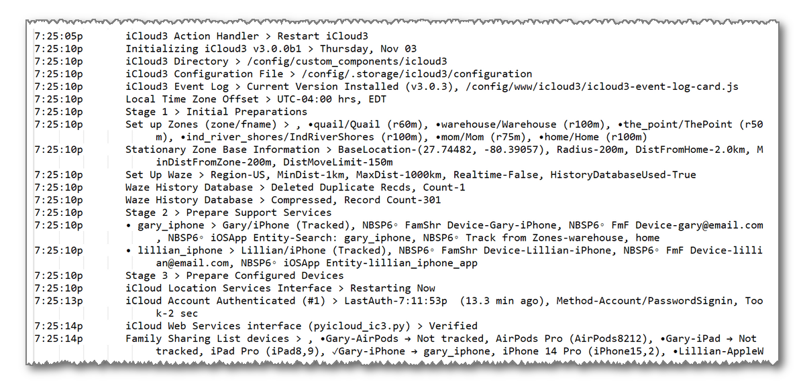
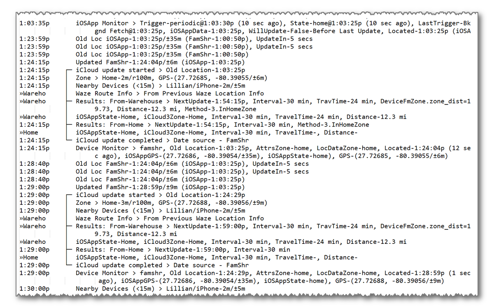
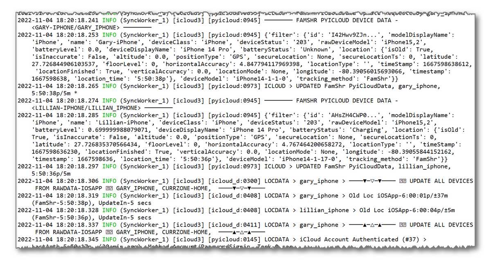
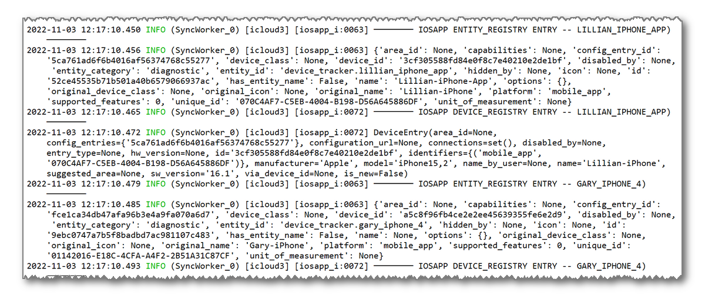

# Other Features


------

### Tracking from more than one Zone

Normally, you track a device from the Home Zone. The sensor entities for travel time, distance, intervals, next update time, etc. are calculated for the Home Zone. iCloud3 also lets you track a device from another zone. It will calculate the same type of sensor entities for that zone. 

To track from another zone, select that zone in the *Track from Zones* parameter on the *Update Tracked iCloud3 Device* screen. 

1. Select the *iCloud3 Devices* screen.
2. Select the device to be tracked from the other zone.
3. Select the *Track-from-Zones* field, then select the zones to be tracked from.



New sensors are created for all of the track-from-zones.

- Sensor Entities - The zone name is added to the end of the entity name.
  - Home Zone -*sensor.gary_iphone_travel_time_home, sensor.gary_iphone_zone_distance_home*, etc.
  - Warehouse Zone - *sensor.gary_iphone_travel_time_warehouse, sensor.gary_iphone_zone_distance_warehouse*, etc.

- Sensor's Friendly Name - The zone's display-as friendly is added to the end of the sensor friendly name:
  - Home Zone - Gary TravelTime (Home), Gary ZoneDistance (Home), etc.
  - Warehouse Zone - Gary TravelTime (Warehouse), Gary ZoneDistance (Warehouse), etc.

The Track-from-Zone sensors mentioned above are optional, only the sensors that will be displayed on a Lovelace card or used in an automation need to be created.  They are selected on *iCloud3 Configurator > Sensors* screen.


The sensors created when only tracking from the Home zone (*sensor.gary_iphone_travel_time, sensor.gary_iphone_zone_distance, etc.*) have changed:

- Closer to the Home zone - Show the Home zone information
- Within 8km of the Other zone and going towards it - Show the Other zone's information
- Within 8km of the Other zone and going away from it - Show the Home zone's information
- Going towards both zones - Show the Home zone's information if more than 8km away from the Other zone
- Other zone's information is displayed - It's first initial is displayed in the *distance* sensor (🅦 is shown for the Warehouse zone).


-----

### Export Event Log

The Event Log is exported to the file */config/icloud3-event-log_[date]_[time].txt* file using the following methods:

- Select *Export Event Log* from the *Event Log > Actions* drop down menu.
- Select *Export Event Log* from the *Configurator > Actions* menu.

The sections on the report are:

- Device configuration parameters
- General configuration parameters
- Start up results
- Device location and tracking results






------

### Display the Waze History on a Map Card

Use the *sensor.icloud3_wazehist_track* sensor entity as the source of a Lovelace map card to see the locations of all of the 11m locations points that have been saved. 

Create a Lovelace map card:


Or copy the yaml code below into the *Show Code Editor* yaml code field on a new Lovelace card.

```type:yaml
type: map
entities:
  - entity: sensor.icloud3_wazehist_track
hours_to_show: 24
```

After the location data has been loaded into the sensor, the resulting map card looks similar to the map below. 


> This really does not have any practical use but it was a fun project to see how many locations had been saved.

Each of the dots on the map is a saved location. Unfortunately, Home Assistant treats the locations on the map card as a tracking point and draws a line between the points in the order they were loaded. Ignore the lines.

To try to display the points in a logical order based on your most frequent driving direction, select *North-South* or *East-West* in the *Waze Location Map Display* field on the *Waze - History Database* parameter screen.


#### Loading the saved locations

The saved locations are loaded into the *sensor.icloud3_wazehist_track* sensor entity several ways.

- Each night at midnight.
- Immediately by selecting *Event Log > Actions > WazeHist - Load track locations for map*
- Immediately by selecting *iCloud3 Configurator > Actions > Waze Hist Map Track - Load route locations for map display*


------

### Debugging with Tracking Monitors

Tracking monitors can be displayed to identify errors and help answer questions related to device availability, poor location data errors, how the tracking results are calculated, etc. The messages are displayed in blue to help identify and highlight them.

- Select *Event Log > Actions > Show/Hide Tracking Monitors* command.


-----

### Debugging with Log Level

The *Log Level* on the *Event Log > Actions* drop down list and on the *Configurator > Other Parameters* screen specify the type of logging records to add to the Home Assistant log file (*home-assistant.log*). They are:

**Info** - Normal operations, add few records for the results of a location request.


**Debug** - Add more detailed records related to location requests, how the data is processed and the results.


**RawData** - Add records for setting up iCloud3 (device_tracker and sensor entities, zones, devices, etc.), the iOS App data used to handle location update and triggers and the data requested from and received from iCloud Location Servers.

